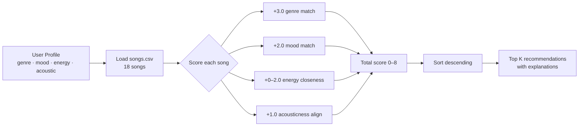

# 🎵 Music Recommender Simulation

## Project Summary

In this project you will build and explain a small music recommender system.

Your goal is to:

- Represent songs and a user "taste profile" as data
- Design a scoring rule that turns that data into recommendations
- Evaluate what your system gets right and wrong
- Reflect on how this mirrors real world AI recommenders

This project builds a content-based music recommender that scores songs from an 18-song catalog against a user's taste profile. It matches genre, mood, energy level, and acousticness preference to rank songs from most to least relevant, and explains each recommendation in plain English.

---

## How The System Works

Real-world recommendation systems like Spotify or YouTube Music use two main approaches. **Collaborative filtering** finds users with similar listening history and recommends what they liked. **Content-based filtering** ignores other users entirely — it compares the features of songs directly to your stated preferences. This project implements content-based filtering, which makes the logic transparent and easy to explain: every score can be broken down factor by factor.

**Song features used in scoring:**
- `genre` — the category of music (pop, lofi, rock, jazz, etc.)
- `mood` — the emotional tone (happy, chill, intense, relaxed, etc.)
- `energy` — activity level from 0.0 (calm) to 1.0 (intense)
- `acousticness` — how acoustic vs. electronic the track sounds (0.0–1.0)

**UserProfile fields used:**
- `favorite_genre` — the genre the user prefers most
- `favorite_mood` — the mood the user is looking for
- `target_energy` — the energy level the user wants (0.0–1.0)
- `likes_acoustic` — whether the user prefers acoustic-sounding tracks

**Algorithm Recipe (max 8.0 points per song):**
1. +3.0 if genre matches `favorite_genre`
2. +2.0 if mood matches `favorite_mood`
3. +0.0 to +2.0 for energy closeness: `2.0 × (1 − |song.energy − target_energy|)`
4. +1.0 if acousticness preference aligns (`acousticness > 0.6` for acoustic lovers; `< 0.4` for non-acoustic)

The recommender scores every song, sorts by score descending, and returns the top k results with a plain-English explanation.

**Data Flow:**



**Known Biases:**
- Genre carries the most weight (+3.0), so a perfect-genre but wrong-mood song will outscore a wrong-genre song with perfect mood and energy. This may over-prioritize genre over feel.
- Songs can score identically even if they feel very different (e.g., different tempo or valence are not used in scoring).
- The catalog of 18 songs is small and skewed toward western genres — no Latin, K-pop, or gospel are represented.

---

## Getting Started

### Setup

1. Create a virtual environment (optional but recommended):

   ```bash
   python -m venv .venv
   source .venv/bin/activate      # Mac or Linux
   .venv\Scripts\activate         # Windows

2. Install dependencies

```bash
pip install -r requirements.txt
```

3. Run the app:

```bash
python -m src.main
```

### Running Tests

Run the starter tests with:

```bash
pytest
```

You can add more tests in `tests/test_recommender.py`.

---

## Experiments You Tried

**Experiment 1 — Weight Shift (genre ÷ 2, energy × 2)**

Changed genre weight from 3.0 → 1.5 and energy weight from 2.0 → 4.0 for the pop/happy/0.85-energy profile. Results for the top 3:

| Rank | Standard weights | Experimental weights |
|------|-----------------|----------------------|
| 1 | Sunrise City (7.94) | Sunrise City (8.38) — unchanged |
| 2 | Gym Hero (5.84) | Rooftop Lights (6.64) |
| 3 | Rooftop Lights (4.82) | Gym Hero (6.18) |

Gym Hero dropped from rank 2 to rank 3 because it had no mood match — with energy worth more, a song with correct mood but no genre match (Rooftop Lights) overtook it. Sunrise City stayed at #1 because it matched all four factors under both weight schemes. Conclusion: the rankings are sensitive to weight changes, but a full-match song cannot be displaced regardless of weight distribution.

**Experiment 2 — Adversarial Profile (conflicting genre + mood)**

Tested genre: ambient, mood: intense, energy: 0.90. No song in the catalog is both ambient and intense. The top result (Spacewalk Thoughts) scored only 4.76/8.0 and earned 0 points for mood or energy closeness. This revealed that the system cannot detect or warn about conflicting preferences — it silently returns a poor result.

---

## Limitations and Risks

- **Tiny catalog.** 18 songs means genre fans with rare tastes (metal, classical) get mostly off-genre results in positions 2–5.
- **Genre dominates.** At +3.0 points, genre is 37.5% of the maximum score. A pop song with the wrong mood still beats a perfect-mood non-pop song.
- **Unused features.** Tempo, valence, and danceability are loaded but never scored. Two songs can feel completely different and receive the same score.
- **No conflict detection.** If genre and mood/energy preferences contradict each other (e.g., ambient + intense), the system returns a bad result without any warning.
- **Western bias.** The catalog only covers western popular music genres. No Latin, K-pop, or Afrobeats songs exist, so users from those backgrounds are underserved.

See [model_card.md](model_card.md) for a detailed breakdown of each limitation.

---

## Reflection

Read and complete `model_card.md`:

[**Model Card**](model_card.md)

Building this recommender showed me how much work a few numerical weights quietly do. Every time the system ran, it was making trade-offs — genre vs. mood, closeness vs. a binary match — and those trade-offs were visible in every result. The most surprising moment was seeing a "perfect" score of 8.0/8.0 for the lofi studier profile and realizing that a perfect result only appeared because the catalog happened to have a song matching all four inputs exactly. Real systems have millions of songs and must still find that match; the math is the same, just at enormous scale.

The clearest bias I found was not in the weights themselves, but in the data. Lofi has three songs in an 18-song catalog. Metal has one. That imbalance means the system is structurally more useful for lofi fans than metal fans before a single line of scoring code runs. This is the same problem real platforms face — if certain genres are underrepresented in training data or catalogs, the algorithm disadvantages those listeners no matter how carefully the weights are tuned. Human judgment is still essential for deciding what data to include, how to weight features, and who the system is actually designed to serve.


---

## 7. `model_card_template.md`

Combines reflection and model card framing from the Module 3 guidance. :contentReference[oaicite:2]{index=2}  

```markdown
# 🎧 Model Card - Music Recommender Simulation

## 1. Model Name

Give your recommender a name, for example:

> VibeFinder 1.0

---

## 2. Intended Use

- What is this system trying to do
- Who is it for

Example:

> This model suggests 3 to 5 songs from a small catalog based on a user's preferred genre, mood, and energy level. It is for classroom exploration only, not for real users.

---

## 3. How It Works (Short Explanation)

Describe your scoring logic in plain language.

- What features of each song does it consider
- What information about the user does it use
- How does it turn those into a number

Try to avoid code in this section, treat it like an explanation to a non programmer.

---

## 4. Data

Describe your dataset.

- How many songs are in `data/songs.csv`
- Did you add or remove any songs
- What kinds of genres or moods are represented
- Whose taste does this data mostly reflect

---

## 5. Strengths

Where does your recommender work well

You can think about:
- Situations where the top results "felt right"
- Particular user profiles it served well
- Simplicity or transparency benefits

---

## 6. Limitations and Bias

Where does your recommender struggle

Some prompts:
- Does it ignore some genres or moods
- Does it treat all users as if they have the same taste shape
- Is it biased toward high energy or one genre by default
- How could this be unfair if used in a real product

---

## 7. Evaluation

How did you check your system

Examples:
- You tried multiple user profiles and wrote down whether the results matched your expectations
- You compared your simulation to what a real app like Spotify or YouTube tends to recommend
- You wrote tests for your scoring logic

You do not need a numeric metric, but if you used one, explain what it measures.

---

## 8. Future Work

If you had more time, how would you improve this recommender

Examples:

- Add support for multiple users and "group vibe" recommendations
- Balance diversity of songs instead of always picking the closest match
- Use more features, like tempo ranges or lyric themes

---

## 9. Personal Reflection

A few sentences about what you learned:

- What surprised you about how your system behaved
- How did building this change how you think about real music recommenders
- Where do you think human judgment still matters, even if the model seems "smart"

